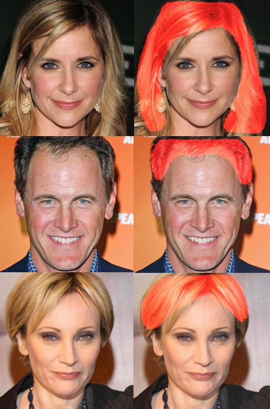

# Hair Segmentation CNN

Proposed Architecture Courtesy of [Alex Levinshtein, Cheng Chang, Edmund Phung,Irina Kezele, Wenzhangzhi Guo, Parham Aarabi](https://arxiv.org/pdf/1712.07168.pdf). I don't know these people personally but please give their paper a read if you have working understanding CNNs, specifically MobileNet.

## Results



## Prerequisites

Tensorflow - Version 2.2.0
Numpy      - Version 1.18.5
Opencv     - Version 4.5.4
Imutils    - Vesion 0.54
Sklearn    - Version 0.24.1

## Train model 

```shell script
python train_mask_detector.py 

optional arguments:
    --image_data_format:    signifying to tensorflow that last index indicates image color channel default='channels_last'
    --mini-batch_size:      mini batch size training, default 10
    --epochs:               number of epochs, default 20
    --steps_per_epoch:      iterations of gradient descent per epoch, default 5
    --lr:                   learning rate, default 1e-4
    --samples:              total amount of images for all iterations of training. i.e. If samples=2000, and set_size=200 the model will be trained 10 times. default 2000
    --set_size:             amount of images use for each iteration training divided between training and       validation set, default 200
    --model_name            name of saved model, default ./new_model.h5 Warning if model with same name exist, it will be overwritten
    --training_cycles:      amount of retraining, default 2 
    --training_data_path:   location of training data, default ./CelebA-HQ-img/
    --testing_data_path:    location of testing data results, default ./CelebAMask-HQ-mask-anno/ 
    --gpu_mem:              amount of gpu memory in GB allocated if gpu is available on systems, default 2
```

## Test model 

```shell script
python test_model_highlight.py [--model PATH_TO_MODEL] [--image_path PATH_TO_IMAGE] []

optional arguments:
    --threshold:       probability that pixel has to exceed or equal to be categorized as hair, default 0.5
    --save_image_path: if you want to save the result image
    --gpu_mem:         amount of gpu memory in GB allocated if gpu is available on systems, default 2

```